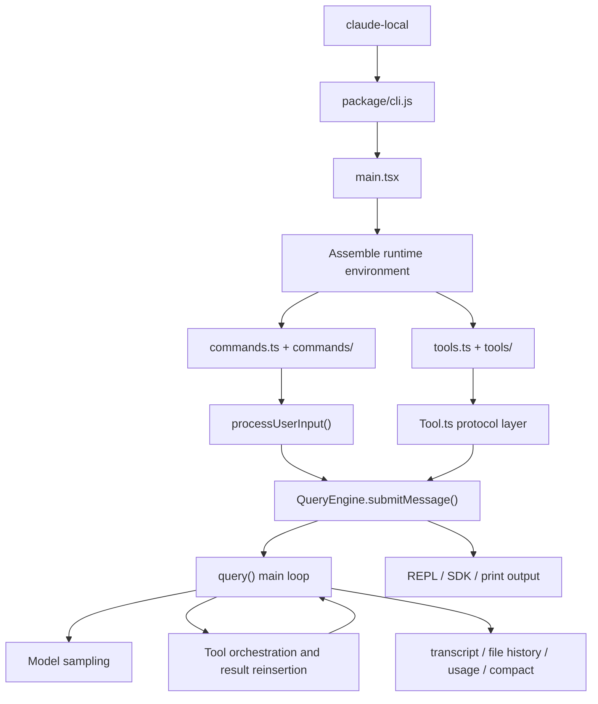

# 🌌 JackProAi-claudecode: Local Deployment Edition

> 👨‍💻 **About Tech Sharing**
> * **Modified by:** JACK杰
> * **WeChat Public Account:** JACK带你玩Ai (Continuous AI updates)
> * **Channels:** Douyin/Bilibili/Xiaohongshu: JACK的AI视界

📖 [阅读中文文档](./README.zh-CN.md)

---

> ⚠️ **Core Disclaimer**
> This is a local deployment build of Claude Code based on the `2026-03-31` leaked code and Source Map restoration.
> This repository is an **unofficial version**, intended strictly for local deployment practice and advanced AI architecture research.

---

## 🛠️ Environment Dependencies & Requirements

Before deploying, please ensure your system meets the following conditions:
* **Runtime Environment:** Node.js 18 or newer
* **Model API:** An Anthropic-compatible API endpoint

---

## 🚀 Quick Deployment Guide

Clone the repository and initialize the local environment with just a few simple commands:

```bash
git clone https://github.com/JackProAi/JackProAi-claudecode.git
cd JackProAi-claudecode
chmod +x claude-local
./claude-local --init-env
```

### 🔑 Core API Configuration

After initializing the environment, you need to modify the configuration file in the root directory for authentication:

👉 **Target File:** `claude-local.env`

If you haven't generated this file yet, please execute the environment initialization command first:

```bash
./claude-local --init-env
```

Open `claude-local.env`, and replace the placeholder with your actual API key:

```bash
ANTHROPIC_AUTH_TOKEN=paste_your_api_key_here
```

---

## 💡 Quick Configuration Example

You can learn from my setup.
I use the SiliconFlow API and selected the KIMI model.
🔗 [SiliconFlow Referral Link](https://cloud.siliconflow.cn/i/mCXH4rCe) — Copy my exclusive referral link.

```bash
# siliconflow example:
CLAUDE_LOCAL_PROVIDER=siliconflow
ANTHROPIC_AUTH_TOKEN=paste_your_api_key_here
# Optional advanced overrides:
ANTHROPIC_BASE_URL=https://api.siliconflow.cn/
ANTHROPIC_MODEL=moonshotai/Kimi-K2-Instruct-0905
ANTHROPIC_SMALL_FAST_MODEL=moonshotai/Kimi-K2-Instruct-0905
```

> 💡 **Pro Tip:** It is highly recommended for beginners to use **CODEX** to read this file and assist with the deployment.

---

## 💻 Command Line Operations

### 🔍 Check version
```bash
./claude-local --version
```

### 💬 Start REPL mode
```bash
./claude-local --bare
```

### ⚡ Fast Prompt
```bash
./claude-local -p "Only reply with: hello" --bare --output-format text
```

---

## 📂 Project Structure

```text
JackProAi-claudecode
├── claude-local
├── package/
│   ├── cli.js
│   └── package.json
├── restored-src/
│   └── src/
│       ├── main.tsx
│       ├── QueryEngine.ts
│       ├── Tool.ts
│       ├── commands.ts
│       ├── tools.ts
│       └── ... (other core directories)
└── extract-sources.js
```

---

## 🧠 Claude Code Architecture Deep Dive

### 1️⃣ Bootstrapping Layer
* **Execution entry:** `package/cli.js`
* **System bootstrapper:** `restored-src/src/main.tsx`

### 2️⃣ Dynamic Command System
Powered by `restored-src/src/commands.ts`. It supports dynamic session state modifications (switching models, permissions, etc.).

### 3️⃣ Tool Assembly Layer
Organizes environment capabilities (Bash, File Operations, etc.) into a controlled "unified tool pool".

### 4️⃣ Tool Protocol Layer
Defined in `restored-src/src/Tool.ts`. Ensures all tool calls carry complete context and strict permission controls.

### 5️⃣ Session Execution Center
The core is `restored-src/src/QueryEngine.ts`, transforming user input into coherent Agent Turns.

### 6️⃣ Orchestration Loop
`restored-src/src/query.ts` handles the Agent main loop: sampling, tool detection, and token management.

### 7️⃣ UI & Infrastructure
Handles terminal rendering and session persistence.

---

## 🕸️ Core Execution Path



---

## 🎯 Architecture Summary

The soul of Claude Code is the trinity collaboration of `main.tsx` (assembly), `QueryEngine.ts` (session), and `query.ts` (Agent loop). It behaves like an **Agent Operating System** inside your terminal.